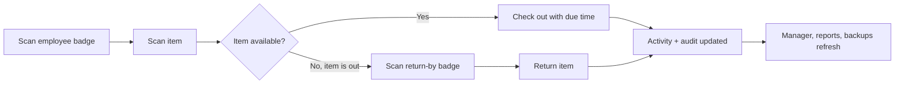

# Macy's AP Accountability System


Public GitHub home for the Macy's AP Accountability System. This repo contains public-safe documentation, sanitized visuals, source package files, release notes, data information, and setup guidance for the Windows desktop app.

> Public safety note: do not upload live databases, backups, logs, reports, real badge numbers, real employee records, AP alerts, incident notes, network paths, or store-specific data.

## Current Release

| Item | Detail |
| --- | --- |
| App name | Macy's AP Accountability System |
| Current version | v5.2.7 |
| Latest package | `Macys_AP_v5_2_7_Flow_Visual_Polish_20260713.zip` |
| Package build date | July 13, 2026 |
| GitHub docs update | July 14, 2026 |
| Validation | Self-test PASS |
| Platform | Windows desktop app |
| Main app file | [`app/macys_ap_v5_2_7.py`](app/macys_ap_v5_2_7.py) |
| Export helper | [`app/macys_ap_export.py`](app/macys_ap_export.py) |
| Download | [Latest GitHub release](https://github.com/rice2k/macys-ap-accountability-system/releases/latest) |

## What It Does

Macy's AP Accountability System tracks controlled AP assets such as keys, radios, temp badges, scanners, tablets, equipment, and other store-issued items. It gives AP teams a scanner-friendly checkout/return workflow, manager visibility, role-based access, AP alerts, logs, reports, Excel exports, backups, and shared database support.

Daily workflow:

- Open Front Desk.
- Scan an employee badge for checkout.
- Scan an item barcode, controlled key number, serial, or device tag.
- Check out the item with due time, condition, and notes.
- For returns, scan the return-by badge and the checked-out item.
- Any scanned return-by badge can return the item; if it differs from the checkout holder, the app records that in notes/audit and does not block the return.
- Managers review open assets, late returns, alerts, issue assets, backups, exports, and logs.

## New In The Latest Build


- Admin-only Front Desk Scan-Only Mode.
- Front Desk can checkout/return without operator login when Admin enables scan-only mode.
- Checkout in scan-only mode: employee badge plus item scan.
- Return in scan-only mode: return-by badge plus checked-out item scan.
- Return acceptance no longer depends on the original checkout holder.
- Manager page has Today's Priorities, backup date/time, backup status, and refresh countdown.
- Front Desk has a large next-step banner, mode chip, function-key shortcuts, and action buttons that enable only when ready.
- Asset entry uses type-specific fields so radios/tablets do not show key-only fields and keys do not show device-only fields.
- Public GitHub docs now include fresh visuals, data information, how-it-works diagrams, version history, and changelog.

## Visual Gallery

The images below are public-safe documentation visuals made with sample data only.

| Overview | Front Desk Scan-Only |
| --- | --- |
|  |  |

| Manager Priorities | Asset Entry |
| --- | --- |
|  |  |

| Data And Backup | Changelog |
| --- | --- |
|  |  |

More guidance is in [Screenshots And Capture Plan](docs/SCREENSHOTS.md).

## Main Features

### Front Desk

- Scanner/mouse/keyboard workflow.
- Scan-only mode controlled by Admin in Settings.
- One scan box handles employee badges, asset barcodes, controlled key numbers, serials, and device tags.
- Checkout mode and return mode are clearly shown.
- Return flow records the return-by badge and item.
- Different-badge returns are accepted and recorded.
- Due presets, custom due time, condition, and notes.
- Function keys: F2 checkout, F3 return, F4 next item same employee, F8 check out, F9 return, Esc start over.

### Manager

- Today's Priorities strip for backup, late returns, alerts, and open assets.
- Backup status band with last backup date, time, status, and refresh countdown.
- Open assets and issue assets tables.
- Manager notifications with filter, note, review, resolve, export, and related-log actions.
- AP alert review and export tools.
- Backup history, export history, audit review, error review, settings, and admin shortcuts.

### Assets

- Asset types: Key, Radio, Temp Badge, Scanner, Tablet, Item, Other.
- Type-specific Add/Edit Asset form.
- Key ring fields for set number, ring serial, number of keys, ring use, and individual key/access list.
- Radio, scanner, and tablet serial/device fields.
- Tablet IMEI/license and accessories.
- Search, filter, sort, duplicate, retire, export selected, export all, and export by type.
- Asset profile with history, AP alerts, print/export, and audit links.

### Users, Permissions, And Alerts

- People/users list with roles, status, departments, and shifts.
- Database-backed groups: Employee, Front Desk, AP Operator, Manager, Admin.
- Protected default groups.
- Group rights grouped by access, people, assets, and admin.
- Person and asset AP alerts with review/resolve/export.
- Restricted checkout conditions require Manager/Admin access.

### Reports, Logs, Backup

- Reports: Current Out, Overdue, Asset Issues, Employee History, Asset History, Alert History, Group History, End of Shift, Detailed Audit, Detailed Error.
- Save reports as TXT, HTML, or Excel.
- Logs page filters audit, errors, manager notifications, and AP alerts.
- Export filtered logs or selected log row.
- Automatic daily backup is on by default.
- Manual backup and restore from Manager/System.
- Shared SQLite database support for multiple workstations.

## How It Works



More detail is in [How It Works](docs/HOW_IT_WORKS.md).

## Data Information

The app uses SQLite and stores operational records in tables for people, assets, activity, audit, errors, manager notifications, AP alerts, groups, and settings. It can run with a local database or a shared/network database.

See [Data Info](docs/DATA_INFO.md) for table descriptions, backup contents, file-output folders, and public upload safety rules.

## Quick Start

1. Download the latest ZIP from [GitHub Releases](https://github.com/rice2k/macys-ap-accountability-system/releases/latest).
2. Extract the ZIP on the Windows workstation.
3. Double-click `Run_Macys_AP_v5_2_7.bat`.
4. Sign in with an operator badge or employee ID, unless Admin has enabled Front Desk Scan-Only Mode.
5. Open Front Desk.
6. Scan badge and item.

Default Admin:

- Employee ID: `F984717`
- Badge: `88984717`

## Repository Map

- [`app/`](app/) - current source package files and validation results.
- [`docs/FEATURES.md`](docs/FEATURES.md) - detailed feature catalog.
- [`docs/HOW_IT_WORKS.md`](docs/HOW_IT_WORKS.md) - workflows and diagrams.
- [`docs/DATA_INFO.md`](docs/DATA_INFO.md) - database, backup, export, and safety info.
- [`docs/SCREENSHOTS.md`](docs/SCREENSHOTS.md) - image gallery and screenshot capture plan.
- [`docs/VERSIONS.md`](docs/VERSIONS.md) - all known v5.2.7 package versions.
- [`docs/PUBLIC_UPLOAD.md`](docs/PUBLIC_UPLOAD.md) - public repo safety checklist.
- [`CHANGELOG.md`](CHANGELOG.md) - latest update log.
- [`SECURITY.md`](SECURITY.md) - security and sensitive-data notes.

## Validation

Latest self-test result:

```text
Overall: PASS

PASS create_database
PASS default_admin
PASS groups_seeded
PASS default_asset
PASS asset_mapping_key
PASS asset_mapping_radio
PASS asset_mapping_badge
PASS asset_add_reload
PASS asset_details_reload
PASS checkout
PASS double_checkout_guard
PASS return
PASS asset_status_update
PASS asset_edit_reload
PASS excel_export_write
PASS counts
PASS dashboard_type_counts
PASS manager_notifications
PASS ap_alert_saved
PASS ap_alert_resolved
PASS audit_error
PASS rich_log_fields
PASS cleanup
```

## GitHub Issues

Use issues for bugs, feature requests, screenshot updates, documentation updates, and release tracking. Do not attach live data or screenshots containing real employee, badge, AP alert, incident, backup, log, database path, or network path details.
