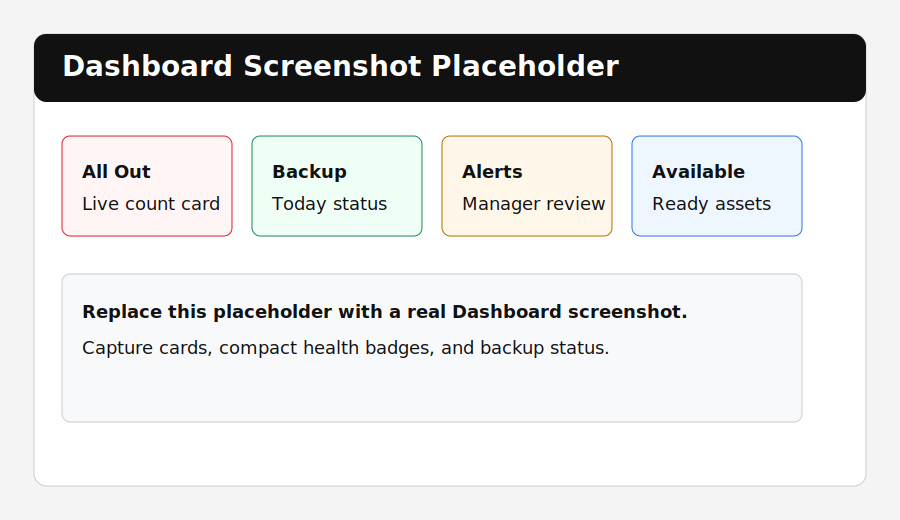
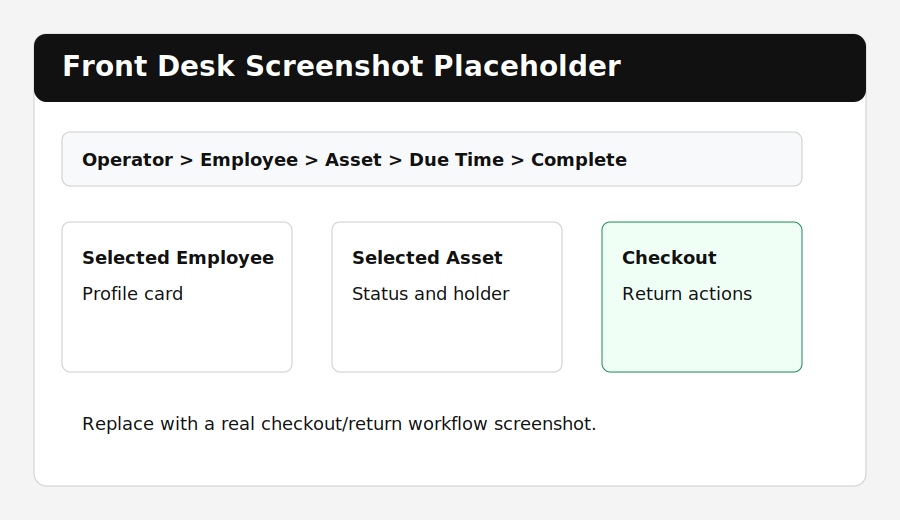
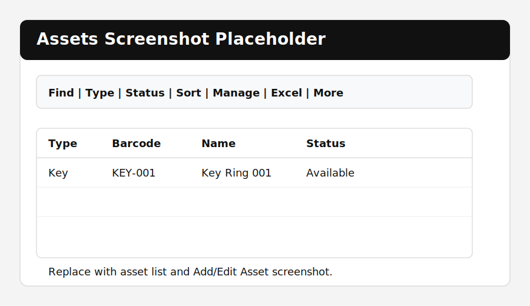
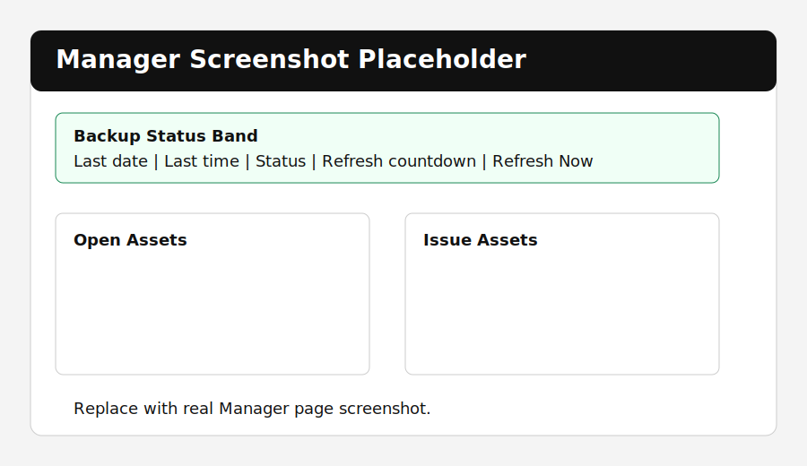
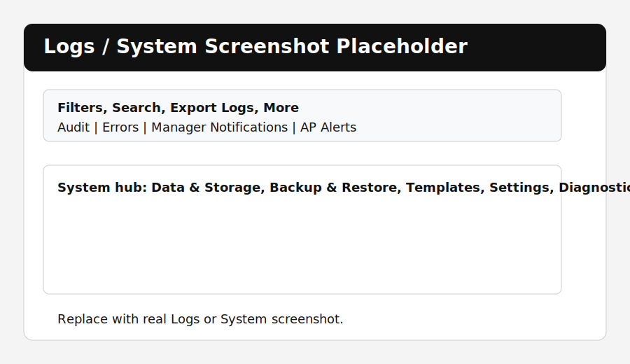
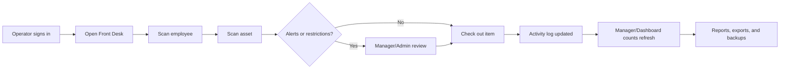

# Macy's AP Accountability System

Public GitHub documentation page for the Macy's AP Accountability System, version v5.2.7.

This repository page is designed for a public GitHub repo or public GitHub Pages site. It documents the app, release notes, setup guidance, screenshot gallery, and support notes. Keep live databases, backup ZIPs, logs, exports, employee records, AP alerts, incident notes, badge numbers, and store data out of GitHub.

## Current Release

| Item | Detail |
| --- | --- |
| App name | Macy's AP Accountability System |
| Current version | v5.2.7 |
| Latest package | Macys_AP_Beta_v5_2_7_Asset_Entry_Improved.zip |
| Latest verified build date | June 18, 2026 |
| Validation | Self-test PASS |
| Platform | Windows desktop app |
| Main file | `macys_ap_v5_2_7.py` |
| Export helper | `macys_ap_export.py` |

## What The App Does

Macy's AP Accountability System tracks controlled AP assets such as keys, radios, temp badges, scanners, tablets, equipment pouches, and other store-issued items. It gives AP teams a structured checkout and return workflow, live asset status, role-based permissions, manager alerts, reports, Excel exports, backups, and searchable logs.

The app is built around daily AP floor operations:

- Sign in with an operator badge or employee ID.
- Scan an employee.
- Scan an asset barcode, key number, radio serial, or device tag.
- Check the item out with due time, condition, and notes.
- Return the item, including wrong-user return handling when needed.
- Review open items, late returns, issues, alerts, exports, logs, and backups from Manager/System screens.

## Screenshot Gallery

Replace the placeholder SVG files below with real PNG screenshots after the app is opened on a workstation. Suggested screenshot names and capture notes are in [docs/SCREENSHOTS.md](docs/SCREENSHOTS.md).

| Area | Preview | Why It Matters |
| --- | --- | --- |
| Dashboard |  | Shows live counts, alerts, system health, backup status, and click-through summary cards. |
| Front Desk |  | Shows the operator to employee to asset to due-time checkout flow. |
| Assets |  | Shows asset search, filters, status tools, Excel export, and type-specific asset entry. |
| Manager |  | Shows open assets, issue assets, backup status, refresh countdown, notifications, and shortcuts. |
| Logs/System |  | Shows audit/error logs, settings, backup/restore, diagnostics, and admin support tools. |

## Main Features

### Dashboard

- Live AP activity cards for all out, keys out, radios out, tablets out, temp badges out, late returns, active alerts, errors today, backup status, available assets, and issue assets.
- Clickable dashboard cards that open filtered detail popups.
- Dashboard detail popups include Excel export and context-menu actions.
- Compact system health badges instead of a long status dump.
- Backup status card showing whether today's backup is complete.

### Front Desk Checkout And Return

- Guided flow: Operator, Employee, Asset, Due Time, Complete.
- Badge and barcode scanning support.
- Scan employee first, then scan asset for checkout.
- Scan checked-out asset to begin return.
- Selected employee, selected asset, and return-by person are displayed as profile cards.
- Due time presets, condition, and notes are available before checkout.
- Wrong-user returns require Manager/Admin access, reason entry, audit logging, and manager notification.
- Restricted, inactive, no-key, damaged, missing, repair, retired, or alert-blocked situations are guarded by permission checks.

### People And Users

- Employee and operator list with role, status, department, and shift.
- Role/group assignment through database-backed groups.
- Person profiles with history and AP alert options.
- Deactivate/reactivate support.
- People import template and import flow.
- Context menus for open/edit profile, AP alerts, audit history, and row copying.

### Assets

- Asset types: Key, Radio, Temp Badge, Scanner, Tablet, Item, Other.
- Search by barcode, name, key number, serial, device tag, location, holder, status, and notes.
- Filter by type and status.
- Sort by type, name, barcode, status, location, key number, radio serial, or holder.
- Add, edit, duplicate, retire, export selected, export all, and export by type.
- Status update tools for Available, Repair, Missing, and Retired.
- Asset profile with history, print/export, AP alert actions, and audit links.
- Type-specific asset entry prevents irrelevant fields from showing or being saved.

### Type-Specific Asset Details

- Keys can track key set number, ring serial, number of keys, ring location, ring use, and each key/access entry.
- Radios can track radio number, factory serial, radio serial, location, and assigned area.
- Tablets can track serial/device tag, IMEI/license data, accessories, and custom accessories.
- Scanners, temp badges, items, and other assets use their own matching fields.
- Keys keep controlled key number and clear serial/device tag.
- Radios, scanners, and tablets keep serial/device tag and clear controlled key number.
- Temp badges, items, and other assets use common fields only.
- CSV imports use the same cleanup and validation as manual asset entry.

### Manager Page

- Daily oversight for open assets, late returns, issue assets, active alerts, and errors.
- Backup status band with last backup date, last backup time, backup status, refresh countdown, and Refresh Now.
- Open Assets and Issue Assets tables.
- Manager notification review, filter, note, resolve, export, and related-log actions.
- AP Alerts review window with status filtering, review/resolve actions, and Excel export.
- Shortcuts for closeout checklist, end-of-shift report, overdue report, asset issues, backup history, export history, log viewer, audit review, error review, settings, and admin tools.

### Reports And Exports

- Current Out report.
- Overdue report.
- Asset Issues report.
- Employee History report.
- Asset History report.
- Alert History report.
- Group History report.
- End of Shift report.
- Detailed Audit report.
- Detailed Error report.
- Save report as TXT, HTML, or Excel.
- Export assets to formatted Excel workbooks by all assets or selected type.
- Export Info sheets include date, 12-hour time, 24-hour time, exported by, role, worksheet names, active page, filter, and search context.
- CSV bundle exports include people, assets, activity, audit, errors, manager notifications, AP alerts, groups, and settings.

### Logs, Alerts, And Audit Trail

- Manager notifications table for failed logins, settings changes, export events, blocked checkouts, overrides, wrong-user returns, AP alert changes, and permission changes.
- AP Alerts table for person and asset alerts.
- Logs page with type filter, user/source, asset/target, action, date range, and search text.
- Export filtered logs to Excel.
- Export selected log rows.
- Archive old matching logs to Excel before clearing them.
- Audit/error records include date, 12-hour time, 24-hour time, operator role, active page, status, and computer name.

### Settings, Backup, And Restore

- Local or shared database path support.
- Shared/custom data refreshes every 15 seconds by default.
- Saved refresh timer setting for configurable auto-refresh.
- Automatic daily backup is on by default.
- Manual backup from Manager and System.
- Backups include the database and CSV files for people, assets, activity, audit, errors, manager notifications, AP alerts, groups, and settings.
- Restore supports backup ZIP or DB file and first backs up the current active database.
- Saved folders for backups, Excel exports, reports, audit logs, error logs, and system logs.
- Settings path fields include browse, open, reset path, and validate write access actions.

### Groups And Permissions

- Default groups: Employee, Front Desk, AP Operator, Manager, Admin.
- Default groups are protected.
- Permissions are database-backed.
- Managers/Admins can add groups, save rights, rename non-protected groups, delete non-protected groups with a reason, view assigned users, and assign users to groups.
- Rights are grouped by Access, People, Assets, and Admin.
- Group changes create audit entries and manager notifications.

## How It Works



The live app stores data in SQLite, writes audit and error records, and can operate from either a local database or a shared/network database. Manager/Admin roles control sensitive actions such as permission changes, restricted checkout overrides, wrong-user returns, log cleanup, and admin tools.

More detail is in [docs/HOW_IT_WORKS.md](docs/HOW_IT_WORKS.md).

## Quick Start

1. Double-click `Run_Macys_AP_v5_2_7.bat`.
2. Sign in with an operator badge or employee ID.
3. Open Front Desk.
4. Scan the employee.
5. Scan the asset.
6. Click Check Out Item or Return Item.

Default Admin:

- Employee ID: `F984717`
- Badge: `88984717`

## Public GitHub Upload

Recommended public setup:

1. Create a new public GitHub repository.
2. Add this documentation package to the repo.
3. Add app source files only if they are approved for public release.
4. Do not commit `.db`, backup ZIP, report output, live export, log files, real employee data, badge numbers, real AP alert details, or incident notes.
5. Keep `README.md` as the GitHub front page.
6. If you use GitHub Pages, publish from the main branch and keep screenshots sanitized.

See [docs/PUBLIC_UPLOAD.md](docs/PUBLIC_UPLOAD.md) and [.gitignore](.gitignore).

## Documentation Map

- [Detailed Features](docs/FEATURES.md)
- [How It Works](docs/HOW_IT_WORKS.md)
- [Screenshots And Capture Plan](docs/SCREENSHOTS.md)
- [Version History](docs/VERSIONS.md)
- [Public Upload Setup](docs/PUBLIC_UPLOAD.md)
- [Security Notes](SECURITY.md)
- [Changelog](CHANGELOG.md)

## Validation

Latest self-test result:

```text
Overall: PASS

PASS create_database
PASS default_admin
PASS groups_seeded
PASS default_asset
PASS asset_mapping_key
PASS asset_mapping_radio
PASS asset_mapping_badge
PASS asset_add_reload
PASS asset_details_reload
PASS checkout
PASS double_checkout_guard
PASS return
PASS asset_status_update
PASS asset_edit_reload
PASS excel_export_write
PASS counts
PASS dashboard_type_counts
PASS manager_notifications
PASS ap_alert_saved
PASS ap_alert_resolved
PASS audit_error
PASS rich_log_fields
PASS cleanup
```

## Included App Files In The Current Build

- `macys_ap_v5_2_7.py` - main app.
- `macys_ap_export.py` - Excel workbook export helper.
- `Run_Macys_AP_v5_2_7.bat` - launcher.
- `Run_Self_Test_No_GUI.bat` - validation test.
- `Build_EXE.bat` - optional EXE builder.
- `people_import_template.csv` - people import template.
- `assets_import_template.csv` - asset import template.
- `macys_star_icon.ico` and `macys_star_icon.png` - app icons.
- `README.txt`, `VERSION_NOTES_v5_2_7.txt`, and self-test result files.

## Support Notes

Use GitHub issues for bugs, feature requests, screenshot updates, documentation updates, and release tracking. Do not attach live data. Templates are included in [.github/ISSUE_TEMPLATE](.github/ISSUE_TEMPLATE).
