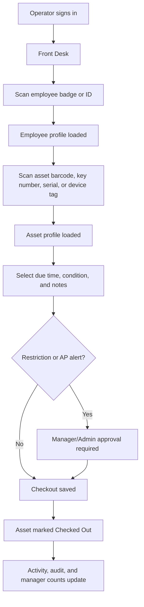
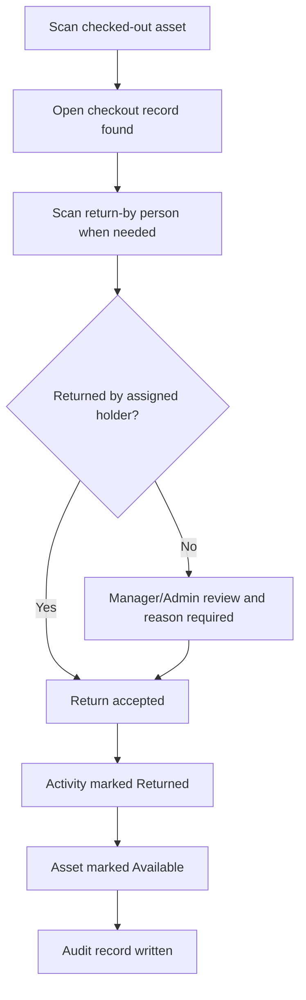
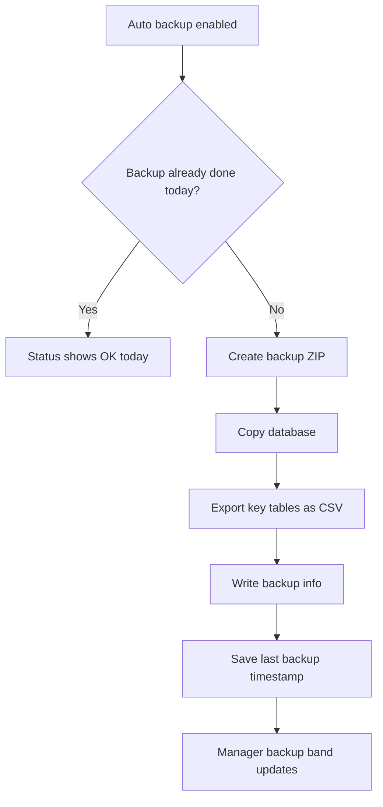

# How It Works

## Daily Checkout Flow



## Return Flow



## Backup Flow



## Data Model Summary

The app uses a SQLite database. The current build includes these major data areas:

- `people` for users, employees, operators, roles, status, shifts, and notes.
- `assets` for controlled assets, status, holder, type-specific details, and notes.
- `activity` for checkouts, due times, returns, conditions, and operators.
- `audit` for user actions and system events.
- `errors` for application errors and diagnostics.
- `manager_notifications` for events managers should review.
- `ap_alerts` for person or asset AP alerts.
- `groups` for database-backed roles and permission sets.
- `settings` for folders, refresh timing, backup settings, display density, and saved paths.

## Access Control

Permission checks happen before protected actions. Manager/Admin access is required for high-risk work such as:

- Restricted checkout overrides.
- Wrong-user returns.
- Missing/repair/retired asset checkout.
- Critical or blocking AP alerts.
- Group rights changes.
- Group deletion or rename.
- Log cleanup.
- Admin tools.

## Shared Data Mode

The app can use a local database or a shared database path. In shared/custom mode, the header shows Shared Data and the app refreshes more often. Every workstation should point to the same `.db` file through System > Change Data File Location.

Recommended shared path format:

```text
\\SERVER\Share\Macys_AP_Data\macys_ap_data.db
```

## File Output

The app can save output to configured folders:

- Backups.
- Excel exports.
- Report exports.
- Audit logs.
- Error logs.
- System logs.

Generated output should not be committed to GitHub unless it is sanitized sample data.

