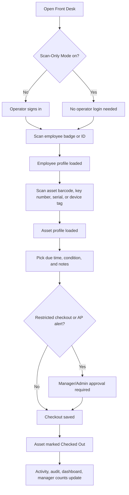
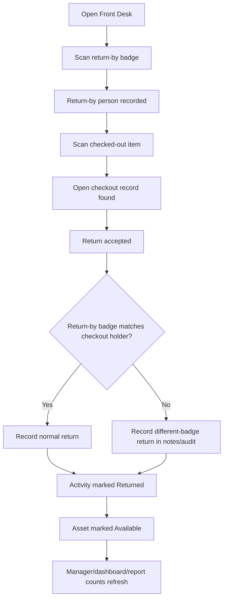
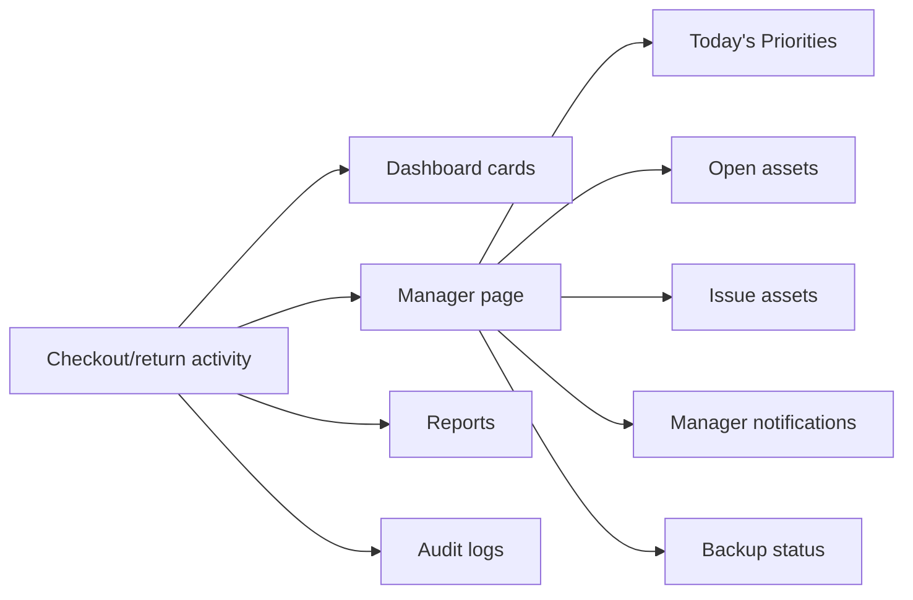
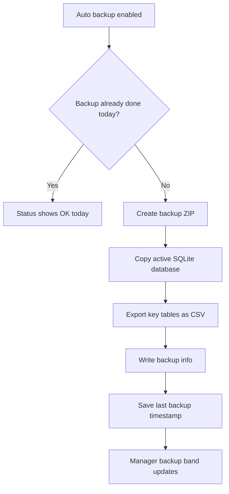

# How It Works

## Checkout Flow

## Return Flow

Return rule: it does not matter who returns the item. The app only needs the return-by badge and the checked-out item scan. If the return-by badge is different from the original checkout holder, the return still completes and the difference is recorded.

## Scan-Only Front Desk Mode

Scan-Only Mode is an Admin-controlled setting in System > Settings.

When off:

- Front Desk requires a signed-in operator with Front Desk access.
- Checkout and return actions are attributed to the signed-in operator.

When on:

- Front Desk checkout/return can run without operator login.
- The header displays Scan-Only Front Desk.
- Checkout uses employee badge plus item scan.
- Return uses return-by badge plus checked-out item scan.
- Audit/notes label the action as Scan-Only Front Desk.

## Manager Oversight Flow

Managers can focus on what needs attention: late returns, active alerts, open assets, issue assets, backup status, failed logins, blocked checkout attempts, export events, settings changes, and log/audit history.

## Backup Flow

## Data Flow Summary

The live app stores data in SQLite, writes audit and error records, and can operate from either a local database or a shared/network database. Exports and backups are saved to folders configured in Settings.

More detail is in [Data Info](DATA_INFO.md).
