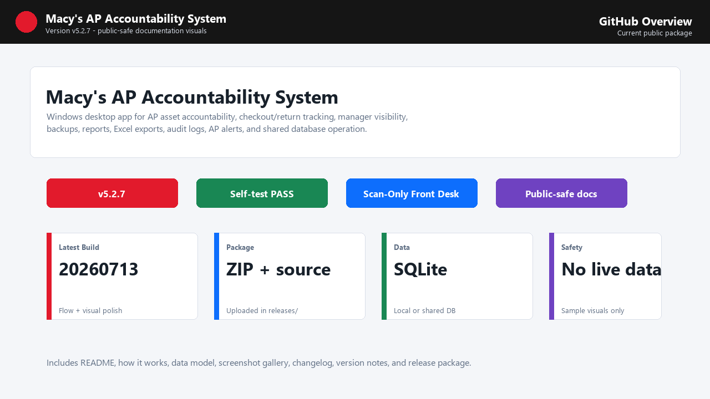
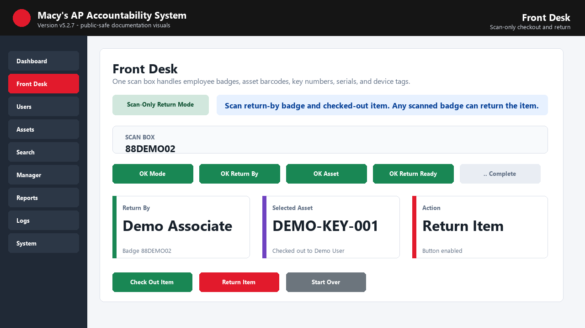
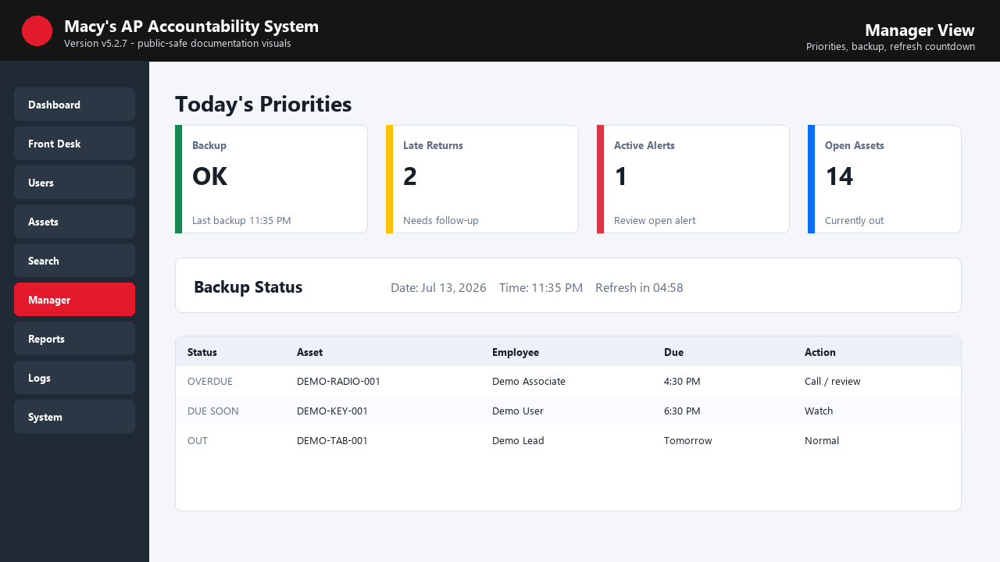
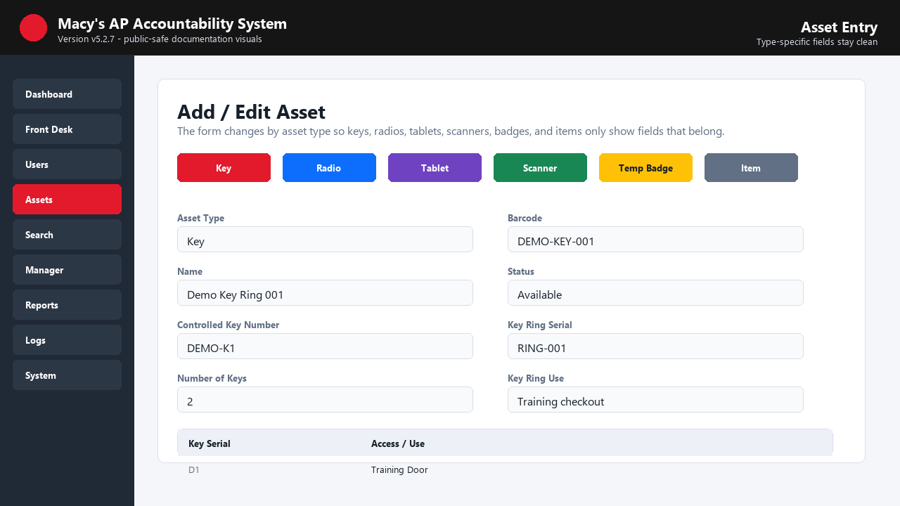
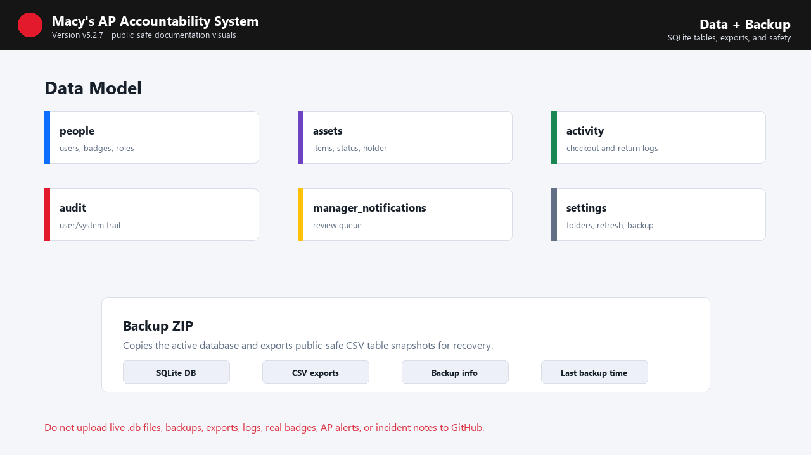
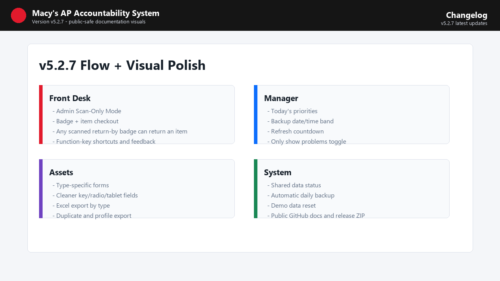

# Screenshots And Visuals

The repo includes public-safe documentation visuals with sample data. These are safe for GitHub and explain the current workflow without exposing live store records.

## Included Visuals

| File | Purpose |
| --- | --- |
| `docs/screenshots/github-overview.png` | Repo and release overview. |
| `docs/screenshots/front-desk-scan-only.png` | Front Desk scan-only checkout/return flow. |
| `docs/screenshots/manager-priorities.png` | Manager priorities, backup status, and refresh countdown. |
| `docs/screenshots/asset-entry-details.png` | Type-specific asset entry. |
| `docs/screenshots/data-and-backup.png` | SQLite data model and backup concept. |
| `docs/screenshots/release-changelog.png` | Latest v5.2.7 changelog summary. |

## Gallery

## Recommended Real Screenshot Files

When sanitized workstation screenshots are ready, add PNG files with these names:

| File | Screen | Capture Notes |
| --- | --- | --- |
| `dashboard.png` | Dashboard | Show live cards, backup card, alert/error cards, and system health badges using sample data. |
| `dashboard-detail.png` | Dashboard detail popup | Open a card and show filtered table plus Excel export option. |
| `front-desk.png` | Front Desk | Show checkout flow, selected employee, selected asset, due time, condition, notes. |
| `front-desk-scan-only-real.png` | Front Desk Scan-Only | Show Scan-Only Mode with badge plus item flow. |
| `assets.png` | Assets | Show search/filter/sort, status tools, Excel export type dropdown, and list. |
| `asset-entry-key.png` | Add/Edit Asset - Key | Show key set number, ring serial, key count, ring use, and key/access list. |
| `asset-entry-tablet.png` | Add/Edit Asset - Tablet | Show serial/device, IMEI/license, and accessories. |
| `asset-profile.png` | Asset Profile | Show holder/status, history, AP alert, print/export options. |
| `manager.png` | Manager | Show priorities, backup status, refresh countdown, open assets, issue assets. |
| `manager-notifications.png` | Manager Notifications | Show filters, note/resolve actions, export, and related-log options. |
| `ap-alerts.png` | AP Alerts | Show active/resolved alert review workflow with sample data. |
| `reports.png` | Reports | Show Daily, History, Export, and Output groups with sample report text. |
| `logs.png` | Logs | Show filters, search, selected row export, and archive/clear options. |
| `system.png` | System | Show data/storage, backup/restore, imports/templates, app/security, diagnostics, and advanced tools. |
| `settings.png` | Settings | Show folders, default export type, refresh timer, display density, and scan-only setting. |
| `groups.png` | Groups / Permissions | Show rights grouped by Access, People, Assets, and Admin. |

## Screenshot Rules

- Use sample data only.
- Do not show real employee names, badge numbers, incident notes, AP alert details, database paths, network paths, logs, or backups.
- Hide or blur usernames and share paths.
- Capture at normal desktop size so buttons and tables are readable.
- Prefer PNG for GitHub display.
- Keep image names lowercase with hyphens.
